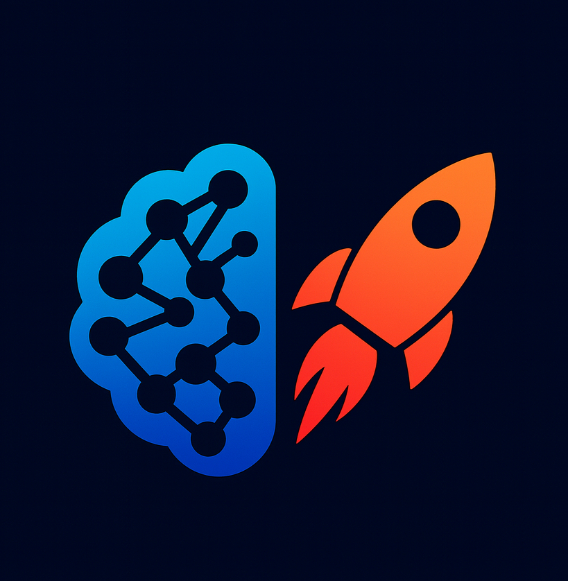

#  Cerebro - AI Learning Intelligence Platform

[](https://opensource.org/licenses/MIT)
[](https://www.javascript.com/)
[](https://nodejs.org/)
[](https://getbootstrap.com/)

> **Learn Smarter, Not Harder** - An AI-powered learning platform that combines intelligent concept extraction, personalized AI tutoring, and scientifically-proven spaced repetition to revolutionize how you study.

</div>

---

## 🌟 Features

### 🤖 **AI Study Buddy**
Your personal AI tutor for any study-related question:
- Context-aware explanations based on your education level  
- Study-only focus to avoid distractions  
- Interactive Q&A with your saved concepts  
- Smart suggestions for techniques and strategies  

### 📤 **Smart Document Parser**
Upload study materials and let AI handle the heavy lifting:
- Automatic concept extraction from notes and textbooks  
- AI-generated flashcards per concept  
- Summaries and structured topic breakdowns  
- Works offline with local fallback  

### 🎯 **Spaced Repetition Flashcards**
Boost retention with science-backed learning:
- AI-generated flashcards with spaced-repetition scheduling  
- Adaptive difficulty (Again, Hard, Good, Easy)  
- Intelligent interval management for long-term memory  
- Progress tracking per card  

### 📝 **Dynamic Quiz Generator**
Quick knowledge checks powered by your concepts:
- Custom quiz lengths (5–20 questions)  
- Multiple-choice questions built from your flashcards  
- Instant correctness feedback  
- Score tracking and performance insights  

### 📅 **Study Planner**
Organize your academic life effortlessly:
- Tasks with due dates and priorities  
- Subject tagging for better organization  
- Completion tracking and progress viewing  
- Alerts for overdue items  

### ⚙️ **Education Level Settings**
AI adapts to how *you* learn:
- Choose from Elementary to Professional levels  
- Simplified or advanced explanations as needed  
- Better alignment with your curriculum  
- Improves accuracy of AI-generated content  

### 📊 **Comprehensive Dashboard**
Visualize your learning growth:
- Mastery percentages and accuracy stats  
- Study streak tracking  
- Concepts learned and cards due  
- Weekly goals overview  

### 🔐 **Flexible Authentication**
Learn how you prefer:
- Sign in for persistent, long-term storage  
- Guest mode for quick temporary sessions  
- Separate data per user  
- Fully local, privacy-focused storage  

---

## 🚀 Quick Start

### Prerequisites

- Node.js v14 or higher
- npm or yarn
- OpenRouter API key (optional, for AI features)

### Installation

1. **Clone the repository**
   ```bash
   git clone https://github.com/DevanshMalhotra17/cerebro.git
   cd cerebro
   ```

2. **Install dependencies**
   ```bash
   npm install
   ```

3. **Set up environment variables**
   
   Create a `.env` file in the root directory:
   ```env
   API_KEY=your_gemini_api_key
   ```

4. **Start the server**
   ```bash
   npm start
   ```

5. **Open your browser**
   
   Navigate to `http://localhost:3000`

---

## 🛠️ Technology Stack

### Frontend
- **HTML5** - Semantic markup
- **CSS3** - Modern styling with gradients and animations
- **JavaScript (ES6+)** - Vanilla JS for maximum performance
- **Bootstrap 5** - Responsive UI framework

### Backend
- **Node.js** - Runtime environment
- **Express.js** - Web application framework
- **CORS** - Cross-origin resource sharing

### AI Integration
- **OpenRouter API** - AI model access (Gemini 2.0 Flash)
- **Local Fallback** - Concept extraction without API

### Data Storage
- **LocalStorage** - Client-side persistence
- **Session Management** - User data handling

---

## 📖 Usage Guide

### 1. Getting Started

**Sign Up / Login**  
- Create an account for persistent data.  
- Or continue as a guest for quick, temporary access.  
- Your data is stored locally and stays separate for each user.  

### 2. Upload Study Materials

**Document Parser**  
- Navigate to the **📤 Upload** tab.  
- Paste your study materials (notes, textbooks, articles).  
- Click **Extract Concepts with AI**.  
- Review and save the concepts you want to learn.

### 3. Chat with AI Study Buddy

**Interactive Learning**  
- Open the **🤖 Study Buddy** tab.  
- Ask anything study-related — learning isn't limited to just your notes.  
- Get explanations, examples, clarifications, or personalized tips.  
- Explore deeper understanding through Socratic-style dialogue.

**Example prompts:**  
- “Explain photosynthesis in simple terms.”  
- “Quiz me on Newton’s laws.”  
- “Give me study tips for biology.”  
- “What’s the difference between X and Y?”  
- “Help me understand this paragraph I uploaded.”

### 4. Practice with Flashcards

**Spaced Repetition**  
- Visit the **🎯 Practice** tab.  
- Flip flashcards to reveal answers.  
- Rate your understanding: **Again**, **Hard**, **Good**, or **Easy**.  
- The system adjusts review intervals to strengthen long-term memory.

### 5. Test Your Knowledge

**Quiz Generator**  
- Go to the **📝 Quiz** tab.  
- Choose your quiz length (5–20 questions).  
- Generate quizzes directly from your saved concepts.  
- Submit answers for instant scoring and feedback.

### 6. Track Progress

**Analytics Dashboard**  
- View detailed learning statistics.  
- Monitor concept mastery percentages.  
- Track study streaks and accuracy.  
- Identify weak areas that need more review.

### 7. Organize Tasks & Assignments

**Study Planner**  
- Open the **📅 Planner** tab.  
- Create tasks with due dates and priorities.  
- Categorize tasks by subject.  
- Track completion and get alerts for overdue items.

### 8. Customize Learning Depth

**Education Level Settings**  
- Go to **⚙️ Settings**.  
- Select your learning level: Elementary, Middle, High School, Undergraduate, Graduate, or Professional.  
- AI explanations adapt instantly to match your level.  
- All concept explanations, flashcards, and quizzes adjust accordingly.

### 9. Manage Your Study Experience

**Account & Authentication**  
- Log in to save your learning permanently.  
- Use Guest Mode if you prefer temporary sessions.  
- All data is stored locally on your browser for privacy.  
- Each account maintains separate concepts, stats, and flashcards.

---

## 🗺️ Roadmap

### Phase 1: Core Features ✅
- [x] Authentication system
- [x] AI concept extraction
- [x] Spaced repetition flashcards
- [x] Quiz generator
- [x] AI Study Buddy chatbot

### Phase 2: Enhanced Learning 🚧
- [ ] Image recognition for diagrams
- [ ] Voice interaction
- [ ] Collaborative study groups
- [ ] Progress badges and achievements
- [ ] Custom study plans

### Phase 3: Advanced Features 📋
- [ ] Mobile apps (iOS/Android)
- [ ] Browser extension
- [ ] Integration with note-taking apps
- [ ] Advanced analytics and insights
- [ ] Gamification elements

---

## 📞 Contact & Support

- **GitHub Issues**: [Report bugs or request features](https://github.com/DevanshMalhotra17/cerebro/issues)
- **GitHub Profile**: [@DevanshMalhotra17](https://github.com/DevanshMalhotra17)
- **Email**: devanshmalhotra17@gmail.com

---

<div align="center">

**Built by [Devansh Malhotra](https://github.com/DevanshMalhotra17)**

**Learn Smarter, Not Harder**

[View Repository](https://github.com/DevanshMalhotra17/cerebro) • [Report Bug](https://github.com/DevanshMalhotra17/cerebro/issues) • [Request Feature](https://github.com/DevanshMalhotra17/cerebro/issues)

</div>